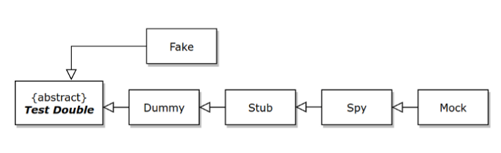

# TDD Workshop

---

This workshop is designed to help you start or improve
your [Test Driven Development](https://en.wikipedia.org/wiki/Test-driven_development)
skills.

The [TDD](../tdd) you will see in this workshop are designed to demonstrate the advantages and technicalities of TDD.
The intention is to represent real-world scenarios, however sometimes that will not be possible in favour of simplicity.

---

## What is TDD

[Test Driven Development](https://en.wikipedia.org/wiki/Test-driven_development) or Test First Development is a process
that consists of turning the requirements of the software application into specific test cases (acceptance criteria) and
then implement the source code.

This process uses the **red/green/refactor** pattern and consists of the following steps:

1. Create Test
2. Run Tests (should fail - Red) 🔴
3. Write Code
4. Run Tests (should pass - Green) 🟢
5. Refactor 🔵

---

## Test Doubles

A Test Double is an object that can stand-in for a real object in a test, similar to how a stunt double stands in for an
actor in a movie.

### The five types of Test Doubles are

- `Dummy`: It is used as a placeholder when an argument needs to be filled in.
- `Stub`: It provides fake data to the SUT (System Under Test).
- `Spy`: It records information about how the class is being used.
- `Mock`: It defines an expectation of how it will be used. It will cause a failure if the expectation isn’t met.
- `Fake`: It is an actual implementation of the contract but is unsuitable for production.