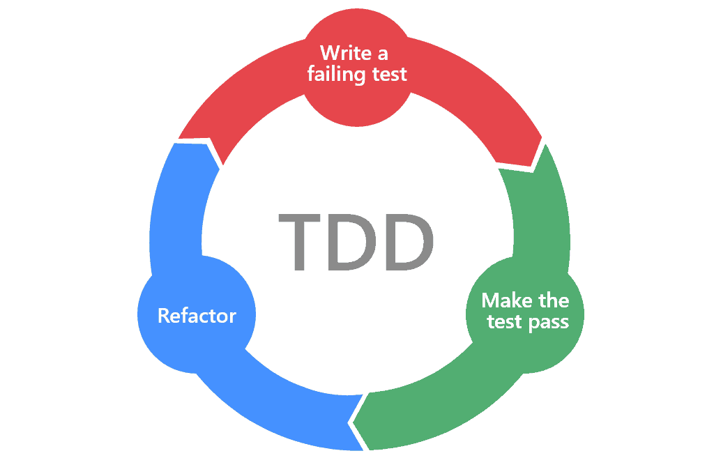

# TDD Workshop

---

This workshop is designed to help you start or improve
your [Test Driven Development](https://en.wikipedia.org/wiki/Test-driven_development)
skills.

The [TDD](../tdd) you will see in this workshop are designed to demonstrate the advantages and technicalities of TDD.
The intention is to represent real-world scenarios, however sometimes that will not be possible in favour of simplicity.

---

## What is TDD

[Test Driven Development](https://en.wikipedia.org/wiki/Test-driven_development) or Test First Development is a process
that consists of turning the requirements of the software application into specific test cases (acceptance criteria) and
then implement the source code.

This process uses the **red/green/refactor** pattern and consists of the following steps:

1. Create Test
2. Run Tests (should fail - Red) 🔴
3. Write Code
4. Run Tests (should pass - Green) 🟢
5. Refactor 🔵
